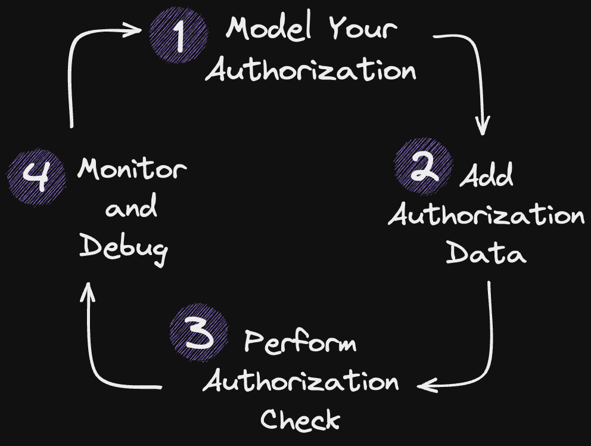

# Developing Authorization for Multi-tenancy Applications
 **Maturity Level**: Application-wide authorization

In this example you’ll create an authorization model for a multi-tenancy application. Multi-tenancy applications host
data and services that belong to several organizations. However, access to data and services should only be granted to
authorized members of a particular organization — not across all organizations.

 This pattern of authorization shows up a lot! We’ll use the example of a human resources application and guide you
 through the 4 steps Oso Cloud provides to build a complete authorization system:

<table>
 <tr>
    <td>
        1. Create an authorization policy that models who’s allowed to do what in your application using Polar. 
        2. Store core authorization data as facts in Oso Cloud. 
        3. Perform authorization checks against your policy. 
        4. Monitor and troubleshoot authorization decisions in realtime from Oso Cloud. 
    </td>
    <td>
        
    </td>
 </tr>
</table>
So let’s get started!

 

---

 

    
        <a href="1-model-your-app-authz.md">→ Next</a>
    

