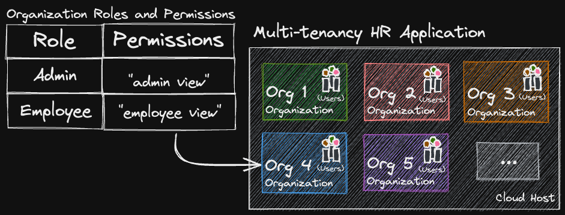

# 1. Model Your Application’s Authorization
**In this section you will:**
- Create a policy that models multitenancy in an HR application.
- Copy and paste the policy into your Oso Cloud [Policy Editor](https://ui.osohq.com/policy/).



Before diving into writing your authorization in a policy, you’ll want to have a clear picture of the application and its parts. As depicted in the diagram above, the human resources (HR) platform hosts many organizations. Each organization has its own set of users and those users have one of two roles: admin or employee. Users of this application have the ability to perform actions based on their role, but ****only**** *within* their organization. Our authorization policy should exist to enforce this view of the world.

## Putting the Building Blocks in Place
To begin building the policy, answer the following questions:

1. Who uses the application? *(Users within an organization).*
1. What resources that make up the application? *(Organizations).*
1. What actions require authorization before a user can perform them? *(Getting an admin view and getting an employee view of the application)*.
1. How are permissions granted within the application? *(Through roles)*.
1. How are permissions attached to roles? (Through logic rules).

Now, all that’s left to do is write what we know in Polar!

```ruby
# 1. Who uses the application?
#    Users are the actors *who* use the application.
#    Users perform actions within an Organization,
#    as defined in the resource block below.
actor User {}

# 2. What resources that make up the application?
#    Organizations are modeled by this resource block.
#    Organizations are *what* Users interact with in
#    the application.
resource Organization {

# 3. What actions require authorization?
#    Permissions represent the actions Users can
#    perform within an Organization.
    permissions = [
        "admin_view",
        "employee_view"
    ];

# 4. How are permissions granted within the application?
#    Roles represent identities Users within
#    Organizations may have.
    roles = [
        "admin",
        "employee"
    ];

# 5. How are permissions attached to roles?
#    The combination of roles and permissions are one
#    way to define authorization for a resource.
#    The rules below grant permissions to specific
#    roles as determined by your application's needs.
    "employee_view" if "employee";
    "admin_view" if "admin";
}
```

> **Action Items**
> <div>
>  <input type="checkbox" name="ai_0">
>   <label for="ai_0">Create a policy that models an HR application..</label>
> </div>
> <div>
>   <input type="checkbox" name="ai_1">
>   <label for="ai_1">Copy and paste this policy into your Oso Cloud <a href="https://ui.osohq.com/policy/"> Policy Editor. </a></label>
> </div>
</br>

Once you have policy saved to your environment, the next step is to add authorization data to Oso Cloud. We’ll explore that topic in the next section.

---

**Additional Resources**
- [What is a policy?](https://www.osohq.com/docs/reference/glossary#policies)
- [What is an actor?](https://www.osohq.com/docs/reference/glossary#actors)
- [What is a resource?](https://www.osohq.com/docs/reference/glossary#resources)

</br>
<p style="text-align:left;">
    <a href="0-human-resources-application.md">← Previous</a>
    <span style="float:right;">
        <a href="2-add-authz-data.md">→ Next</a>
    </span>
</p>