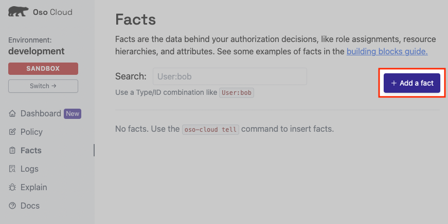
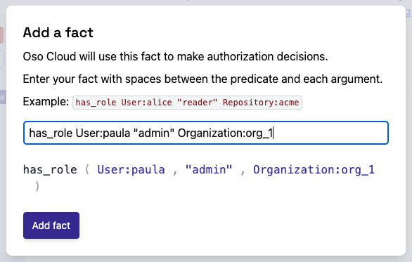
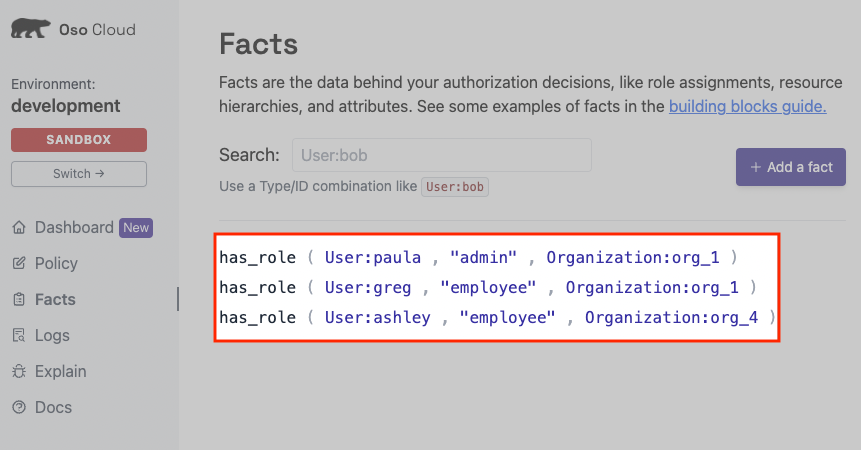

# 2. Add Authorization data to Oso Cloud
**In this section you will:**
- Identify what data you’ll need for authorization
- Write authorization data as facts.
- Use the [Facts page](https://ui.osohq.com/facts/) to store authorization data in Oso Cloud.

In the previous section you uploaded a policy to Oso Cloud. You can now add facts to Oso Cloud about the Organizations
and the Users within those organizations. First, we’ll take a look at parts of the existing policy to understand what
data you’ll need for authorization.

## Identify Data Needed for Authorization
You can get a sense of the data you’ll need for authorization by looking at the rules related to a particular
`resource`. In the example policy we provided, there are two rules contained in the Organization resource block.

```ruby
actor User {}

resource Organization {
	...
    # Rule definitions for roles that
    # are part of your Organization.
    "employee_view" if "employee";
    "admin_view" if "admin";
}
```

Both rules are created from the same type of information: a *permission* assigned to a *role*. What is not obvious from
rule statements alone, is ****who**** these rules will apply to****.****

In Polar, when you write rules for roles inside a resource block (as you have done here), any defined `actor` can be
the ***who*** for the given rule. In this case there is one defined `actor` type: *****Users*****.

Putting this all together yields the following set of information needed for authorization:

- Who the user is
- What organization they are part of
- What role they have within the organization

> **Action Items**
> <div>
>     <input type="checkbox" name="ai_0"/>
>     <label for="ai_0"> Identify the data needed for authorization.</label>
> </div>

## Write Authorization Data as Facts
In the previous section we identified the information necessary for writing authorization data for the example policy.
The table below provides concrete examples of that information which you can use to write as facts to store in Oso
Cloud.

| User | Organization | Role |
| --- | --- | --- |
| Paula | Org 1 | admin |
| Greg | Org 1 | employee |
| Ashley | Org 4 | employee |

### Use the Facts Page to Store Facts in Oso Cloud
Navigate to the [Facts page](https://ui.osohq.com/facts/) in your Oso Cloud environment.

Click the “Add a fact” button.



This opens a new modal window where you can add a fact.



We’ve written the u*ser*, o*rganization*, and *role* information as facts that you can copy and paste one by one into
the modal window in Oso Cloud. Each fact describes the role a particular user has within a particular organization.
Tell Oso Cloud that:

1. *Paula* has the role *admin* within the *Org 1* organization.
    ```ruby
    has_role User:paula "admin" Organization:org_1
    ```

1. *Greg* has the role *employee* within the *Org 1* organization.
    ```ruby
    has_role User:greg "employee" Organization:org_1
    ```

1. *Ashley* has the role *employee* within the *Org 4* organization.
    ```ruby
    has_role User:ashley "employee" Organization:org_4
    ```

> **Action Items**
> <div>
>     <input type="checkbox" name="ai_0"/>
>     <label for="ai_0"> Use the <a href="https://ui.osohq.com/facts/">Facts page</a> to add each of the three facts aboveto Oso Cloud.</label>
> </div>
<br/>

When you’ve finished your Facts page will now display all the facts stored in Oso Cloud.


<br/>

---

**Additional Resources**
- [What are facts?](https://www.osohq.com/docs/reference/glossary#facts)

<br/>
<p style="text-align:left;">
    <a href="1-model-your-app-authz.md">← Previous</a>
    <span style="float:right;">
        <a href="3-perform-authz-checks.md">→ Next</a>
    </span>
</p>