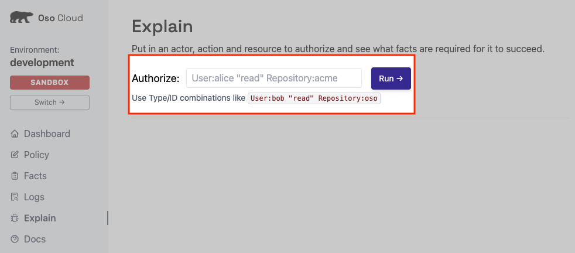

# 3. Perform Authorization Checks

**In this section you will**:

- Use Oso Cloud to perform authorization checks
- Validate an authorization allowed result
- Validate an authorization denied result

Congratulations! If you are ready to perform authorization checks, that means you have an authorization policy and data that Oso Cloud can enforce. Now you’ll use the [Explain page](https://ui.osohq.com/explain/) to begin performing authorization checks against your policy and that data.

# Writing Authorization Checks

Authorization checks ask specific questions about what actions an actor is *allowed* to perform. The types of checks that you can make come directly from the rules you write in your policy.
Take another look at the policy we presented in the first section [1. Model Your Application’s Authorization](./1-model-your-app-authz.md). Here are the two rules we introduced in the *resource block*:

```ruby
resource Organization {
    ...
    # You can read these rules as
    # A user has THIS <permission> IF they have THIS <role>.
    "employee_view" if "employee";
    "admin_view" if "admin";
}
```

Although each rule has a unique permission and role, they both enforce the same model: *granting a permission based on the user’s role.*

In the second section, [2. Add Authorization Data to Oso Cloud](./2-add-authz-data.md), you added facts to Oso Cloud. These facts stored information about user roles within an organization.

Now in this section, when you write your authorization checks, you’ll ask a direct question to Oso Cloud about user permissions: **does a user have permission (fill in the blank) within this organization?* And, just as there is some structure to how to write a policy, there is some structure in how to write authorization checks.

```ruby
# <USER>   <PERMISSION>     <RESOURCE>
User:paula "admin_view" Organization:org_1
```

Continue using this structure to run authorization checks against your policy.

# Run the Authorization Check Using Explain

Begin by opening the [Explain page](https://ui.osohq.com/explain/).

Use the Authorize edit box to enter an authorization check and click “Run” to perform the check.



Below are 5 example authorization checks you can perform. The results of these checks depend on the facts provided in the previous section: [2. Add Authorization data to Oso Cloud](https://www.notion.so/d56f271cf08a4dc9912a69d174875328).

1. Does the user *Paula* have *admin view* permissions within the *Org 1* organization?

    ```
    User:paula "admin_view" Organization:org_1
    ```


1. Does the user *Greg* have *employee view* permissions within the *Org 1* organization?
    ```
    User:greg "employee_view" Organization:org_1
    ```

1. Does the user *Ashley* have *employee view* permissions within the *Org 4* organization?
    ```
    User:ashley "employee_view" Organization:org_4
    ```

1. Does the user *Ashley* have *admin view* permissions within the *Org 4* organization?
    ```
    User:ashley "admin_view" Organization:org_4
    ```

1. Does the user *Ashley* have *employee view* permissions within the *Org 1* organization?
    ```
    User:ashley "employee_view" Organization:org_1
    ```

**Action Items**
> <div>
>   <input type="checkbox" name="ai_0">
>   <label for="ai_0">Use the <a href="https://ui.osohq.com/explain/">Explain page</a> to run each of the authorization checks above.</label>
> </div>
</br>

---

**Additional Resources**

</br>
<p style="text-align:left;">
    <a href="2-add-authz-data.md">← Previous</a>
    <span style="float:right;">
        <a href="4-monitor-and-debug-authz.md">→ Next</a>
    </span>
</p>