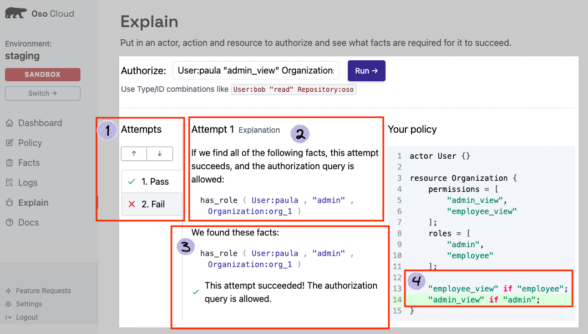
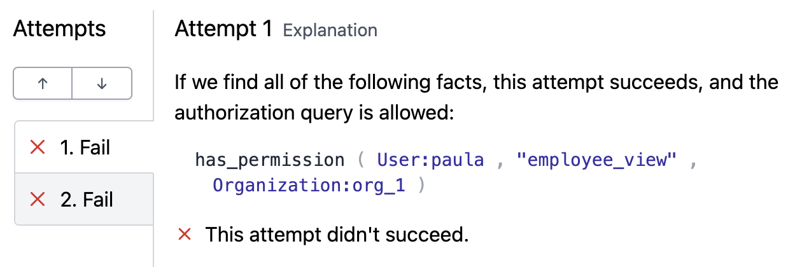

# 4. Monitor and Debug Your Authorization

**In this section you will**:
- Use the Explain page to check user permissions.
- Navigate through *Pass/Fail* attempts.
- Modify your existing policy based on Explain page results.

As you may have noticed from the previous section, the Explain page does more than just running your authorization
checks. It also provides you with some explanation as to why a particular authorization attempt passed or failed. In
this section you will use information from the Explain page to make improvements to your policy.

## How it Works
The result of an authorization check can be one of two logical states: *true* or *false*. The table below shows the
different words that are used in association with those two states.

| Authorization Check Result | Words Used in Association |
|----------------------------|---------------------------|
| **true** | *pass* <br /> *succeeded* <br /> *allowed* |
| **false** | *failed* <br /> *did not succeed* <br /> *denied* |

However, the *result* and what you *intend* as a result may differ. An authorization check that you thought *should*
succeed may fail. Similarly, an authorization check that failed may be one you expected to pass. The Explain page
exists to help in these scenarios. It provides visibility into why an authorization check did or didn't succeed.

### Explain Page Layout
There are 4 key areas to the page as numbered in the image below.


**1. Select Attempts**<br />
Use the arrows or click on a tab to select an attempt.

An attempt explains *one way* (out of possibly many) an authorization check can succeed. A green check mark and the
word "Pass" indicates that the authorization check succeeded during that attempt. A red x and the word "Fail" indicates
that the authorization check did not succeed during that attempt.
> *__NOTE__: Multiple successful attempts can exists. However, only one successful attempt is needed for an
authorization check to pass.*

**2. The condition for the attempt to succeed**<br />
This section of the page lists the facts that are needed for an authorization check to succeed in the given attempt.
Each attempt presents a unique set of facts. It **DOES NOT** represent the facts that are currently in your
environment.

**3. The facts currently existing in your environment**<br />
This section shows the facts currently in your environment that support successful authorization attempts. If an
authorization attempt fails, nothing will be shown in this section.

**4. The part of your policy is evaluated when the authorization check is made**<br />
This section shows the rule within your policy that enforces the authorization check for a given attempt. Each attempt
will highlight the rules within your policy that contribute to enforcing the authorization check.

## Using Explain to Improve Your Authorization
Run the following authorization check using the [Explain page](https://ui.osohq.com/explain/).
```
User:paula "employee_view" Organization:org_1
```



Remember, Paula was assigned an admin role in [Add Authorization data to Oso Cloud](./2-add-authz-data#write-authorization-data-as-facts). Given the current policy, this authorization attempt does not give the admin Paula, the ability to see an *employee view* of the organization *Org 1*. Should this be the case?

<Callout>
**Action Items**
<div>
    <input type="checkbox" name="ai_0"/>
    <label for="ai_0"> Click on each attempt to see what information Oso Cloud used to make its decision.</label>
</div>
</Callout>

### Option 1
The first attempt shows you that if user Paula is given the `employee_view` permission explicitly, then our
authorization attempt would succeed.
Adding the fact:

`has_permission (User:paula, "employee_view", Organization:org_1)`
would allow the authorization attempt to succeed. However, one consideration to make is that it requires adding a
*permission* as a fact rather than a *role*. So far, all of the authorization data given to Oso Cloud has been based on
roles, not permissions.

### Option 2
Another other option comes from the second attempt.

You could add another role for the user Paula. In this case, two facts would exist:
- One stating that Paula is an admin
- Another stating that Paula is an employee
While admins may also be employees, it's also conceivable that in some cases admins are distinct from employees and
should not be modeled that way. In general it can lead to confusion.

### Option 3
But, there exists a third option! If it does not make sense to add the facts presented in the attempts, this suggests
that the initial authorization model (developed in
[Model Your Application’s Authorization](./1-model-your-app-authz)) could be improved.


The policy has the following rules within the Organization resource block:
```ruby
resource Organization {
    ...
    "employee_view" if "employee";
    "admin_view" if "admin";
}
```
If admins should also have the ability to see an employee view of an organization, then it can be modeled by adding the
`employee_view` permission to admin roles.

With simple authorization rules, it's not hard to keep in mind the various combinations. But, as policies become more
complex, seeing the various permutations of facts needed for successful authorization attempts can bare to light bugs
or shortcomings in your policy.


## Updating Your Policy
Add the following rule to your existing Organization resource block.
```
"employee_view" if "admin";
```

Your resulting policy will look like this:
```ruby
actor User {}

resource Organization {
    permissions = [
        "admin_view",
        "employee_view"
    ];
    roles = [
        "admin",
        "employee"
    ];

    # Rules granting permissions to the employee role.
    "employee_view" if "employee";

    # Rules granting permissions to the admin role.
    "admin_view" if "admin";
    "employee_view" if "admin"
}
```

> **Action Items**
> <div>
>     <input type="checkbox" name="ai_0"/>
>     <label for="ai_0"> Update your existing policy with the new version above.</label>
> </div>
> <div>
>     <input type="checkbox" name="ai_1"/>
>     <label for="ai_1"> Re-run the authorization check: <br /> &emsp; <code>User:paula "employee_view" Organization:org_1</code> </label>
> </div>

After updating your existing policy with this new version, you will observe that Oso Cloud now recognizes the user
Paula has both permissions: `employee_view` and `admin_view`.

<br/>

---


<br/>
<p style="text-align:left;">
    <a href="3-perform-authz-checks.md">← Previous</a>
    <span style="float:right;">
        <a href="5-summary.md">→ Next</a>
    </span>
</p>